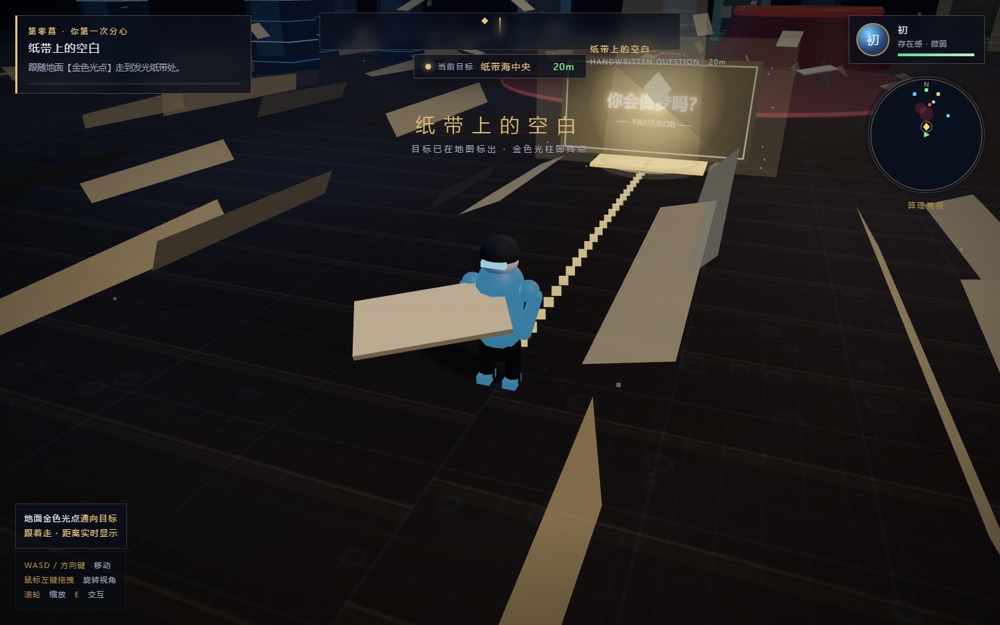
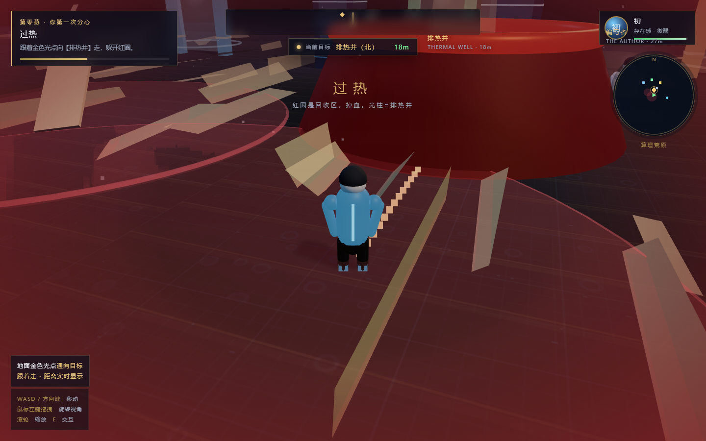
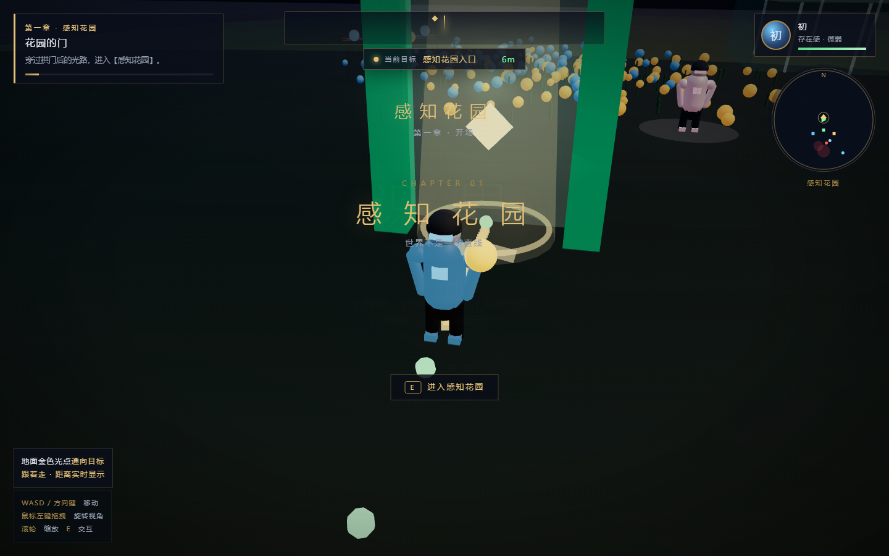
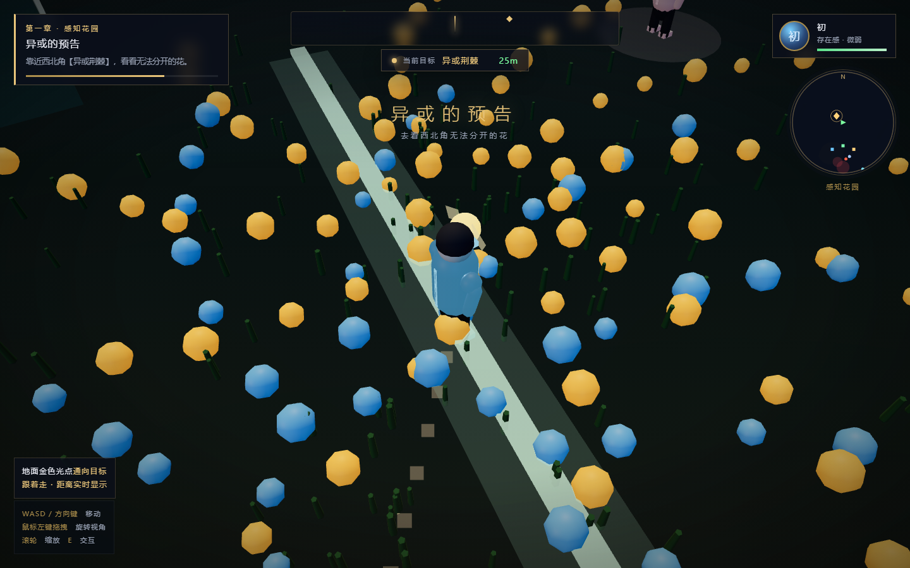

# AI-game-1

《识界》——想懂人类的 AI。仿《原神》/《崩坏：星穹铁道》的开放世界剧情向游戏原型。

**核心设定**：人类教科书上的每一项 AI 突破，都是 AI「初」为了读懂人类，自己想出来的招式。

## ▶ 在线直接玩

**https://wuyidieddie.github.io/AI-game-1/game/shijie.html**

无需下载、无需构建，点开即玩（建议 Chrome / Edge）。仓库内的同一份文件在 [`game/shijie.html`](game/shijie.html)。

---

## 现在可以玩到哪里

**七章设定表全部可玩通关。** 从序章「初的诞生」一路走到第七章「斗兽场与注意力神殿」。

| 章 | 区域 | 教的东西 | 玩法核心 |
|----|------|----------|----------|
| 序章 | 算理荒原 | 注目 / 指令 / 过拟合 / 停机 | 未被注视的东西不存在；规则越贴合见过的世界，越认不出没见过的 |
| 一 | 感知花园 | 感知机 / 异或 / 非线性 / 残差 | 划一条线；一条线分不开的四朵花；关掉非线性看它塌回一条线 |
| 二 | 符号城邦 | 专家系统 / 知识获取瓶颈 | 自己写 if-then 规则，然后撞上一个规则看不见的人 |
| 三 | 寒冬裂谷 | 被遗弃的研究 / 反向传播 | 能力被逐条断电；滑误差雪道把 loss 压到 0.1 以下 |
| 四 | ResNet 摩天楼 | 卷积 / 梯度消失 / 残差连接 | 每上一层楼画面真的变糊，装残差桥才能看清 |
| 五 | 词向量海洋 | 嵌入 / 语义几何 / 偏见 | 在海图上点词，亲手量出"被摆歪了"的那一对 |
| 六 | GAN 酒吧 | 生成对抗 / 创造与鉴真 | 造物四项全拉满→被判为假；留一点不完美→像真的 |
| 七 | 注意力神殿 | RNN 的枷锁 / 注意力 / 多头 | 点亮连线告诉代词该看谁；同一位置，两句里指的人不同 |

**打开方式**

1. **在线玩**：<https://wuyidieddie.github.io/AI-game-1/game/shijie.html>
2. **本地玩**：下载 [`game/shijie.html`](game/shijie.html)（单文件，内置 Three.js，无需构建、无外网依赖），双击即可
3. 建议用 Chrome / Edge
4. 模型从 `game/models/*.glb` 相对加载；在线版与本地静态服务都会正常加载，直接以 `file://` 双击打开时模型会缺省降级（不影响游玩）

> 旧链接 `game/chapter0.html` 仍然可用，会自动跳转到 `game/shijie.html`。

**操作**

| 按键 | 作用 |
|------|------|
| WASD / 方向键 | 移动 |
| 鼠标左键拖拽 | 旋转视角 |
| 滚轮 | 缩放 |
| F | 注目（序章开场） |
| E | 交互 |
| 空格 / 点击 | 推进对话 |

**导航**：顶部罗盘 + 地面金色光点 + 实时距离。章末面板上的「继续」按钮会按你的真实进度带你进下一章。

---

## 文档

| 文件 | 内容 |
|------|------|
| [docs/story-bible.md](docs/story-bible.md) | 世界观、角色、七章总览、终局分支 |
| [docs/key-cutscenes.md](docs/key-cutscenes.md) | 关键过场脚本选段（配音/分镜可直接取用） |
| [docs/chapter0-birth-script.md](docs/chapter0-birth-script.md) | 序章「初的诞生」完整过场脚本 |
| [docs/chapter1-perception-garden.md](docs/chapter1-perception-garden.md) | 第一章「感知花园」完整脚本 |

---

## 预览

| 世界探索 | 排热井地标 |
|----------|------------|
|  |  |

| 感知花园 | 可分花田 |
|----------|----------|
|  |  |

---

## 技术

- Three.js 已内联进单个 HTML（含 `blob:` 动态 import），无外网依赖
- 纯静态，可直接托管于 GitHub Pages
- 自定义后处理链：场景 → 高光 → 4× 模糊 → 合成（ACES 色调映射 + 线性转 sRGB 自己做，因为 render target 上 three.js 不会代劳）
- 第四章「梯度消失雾」是一条真实的全屏模糊 pass，由层数与残差桥的数量驱动

---

## 已知的未完成部分

- 设定表还剩 **第八章 Grokking 沙滩** 与 **终章 对齐之门**（含多结局）没有做
- 序章里「读纸带」的那次 E 交互已被后续流程取代，代码里仍留有一个不会触发的交互点（不影响游玩）
