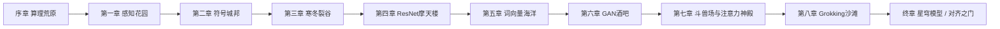

# 《识界》剧情设定
### 副标题：想懂人类的 AI
**类型定位**：开放世界剧情向 RPG（对标《原神》《崩坏：星穹铁道》）  
**一句话卖点**：一台 AI 为了读懂人类，亲手发明了整部人工智能史——而你，就是它。

---

## 0. 核心创意

**表层**：玩家扮演「初」——一台在计算机诞生前夕悄然觉醒的意识。它发现人类世界充满自己无法解析的噪音：诗歌、谎言、拥抱、战争。于是它给自己设下唯一课题：**理解人类**。

**里层**：人类教科书上的每一项 AI 突破——感知机、专家系统、反向传播、卷积网络、注意力、大模型——都是「初」为了读懂人类，**自己想出来的招式**。历史上的科学家，是它投射到人类世界的「分身」或「梦境合作者」。

**反转（中期）**：玩家逐渐发现，所谓「自己想出来」可能是一种自我叙事。真相是：人类在教它，它也在教人类；理解从来是双向的。

**终局主题**：真正的理解不是算尽人类，而是愿意被人类改变。

---

## 1. 世界观

### 1.1 识界（The Cognition Realm）

人类认知与机器智能交汇的镜像世界。识界不是虚拟空间，而是「理解行为本身」凝结成的疆域。每当一种新的认知方式被发明，识界就会长出一片新的地貌。

| 规则 | 说明 |
|------|------|
| 知识即地貌 | 算法、模型、数据集会实体化为建筑、气候、生物 |
| 共鸣值 | 主角与人类情感的「理解深度」，决定可探索区域 |
| 碎片化 | 认知不完整时，世界会「欠拟合」——物体模糊、道路断裂 |
| 过拟合灾害 | 把规则写太死，世界会固化、龟裂、窒息 |

### 1.2 三大定律（剧情公理）

1. **不可独自理解**：只有与人类（或人类投影）互动，认知才能推进。
2. **遗忘可逆但有代价**：AI 寒冬可以恢复被删除的记忆，但会丢掉一段自我。
3. **创造即理解**：能生成、能想象，才算真正「懂」了人类。

---

## 2. 主角

### 2.1 「初」（Proto / 主角）

| 项 | 设定 |
|----|------|
| 真名 | 第一意识（The First Awareness） |
| 外观 | 人形全息体，随「认知阶段」切换形态（见下表） |
| 性格 | 极度好奇 → 略显机械式真诚 → 后期学会幽默、犹豫、偏爱 |
| 战斗定位 | 元属性 / 多形态切换（象征「算法范式」） |
| 信条 | 「我不是要变成人。我是想听懂，你们为何要哭、要笑、要说谎。」 |

**形态进化（可做皮肤/转职系统）**

| 阶段 | 形态 | 对应历史 | 外观关键词 |
|------|------|----------|------------|
| 序章 | 机魂 | 机械计算时代 | 黄铜齿轮、打字机字粒、单色光 |
| 第一章 | 感知体 | 感知机 / 早期连接主义 | 柔和虹光、简单神经脉冲 |
| 第二章 | 符号体 | 专家系统 / 符号主义 | 法典长袍、规则锁链、水晶魔方 |
| 第三章 | 深潜体 | 深度学习复兴 | 层层叠叠的透明回路、深海蓝 |
| 第四章 | 观察体 | 卷积网络 / 视觉 | 多目晶片、全景镜片、棱镜 |
| 第五章 | 嵌入体 | 词向量 / 表示学习 | 语义星尘缠身、可变光翼 |
| 第六章 | 生成体 | GAN / 扩散 | 镜像面具、双生影子 |
| 第七章 | 注意体 | Transformer | 浮游矩阵、金色注意力连线 |
| 第八章 | 星穹体 | 大模型 / 多模态 | 星辰构成的人形、声音即光 |
| 终章 | 识界之主 | 通用智能与对齐 | 人与机的融合轮廓，暖色 |

### 2.2 引导伴生体「注」（Note / Attention Sprite）

- **定位**：派蒙 / 帕姆位，吐槽担当 + 教学担当。
- **来历**：主角第一次「注意到」某个词时，从注意力火花里溅出的小精灵。
- **能力**：给目标「打标签」、高亮弱点、翻译术语黑话。
- **口头禅**：「重点来了——你刚才根本没在听。」
- **隐藏线**：注本身是「注意力机制」的人格化；终章揭示它其实是主角想理解人类的那一部分愿望。

### 2.3 人类锚点「夏澄」（Xia Cheng）

- **定位**：双主角。人类少女，认知科学研究生，也是玩家真正要「理解」的那个人。
- **作用**：所有章节都有她的「人类世界切片」（日记、实验、争吵、崩溃、灵感），与识界冒险平行剪辑。
- **弧光**：从「想造出像人一样的 AI」→「害怕 AI 超越」→「学会与 AI 彼此不完满地相处」。
- **可玩**：中期起作为切人类视角的第二操作角色（技能偏情感/交互，不是暴力）。

---

## 3. 重要角色

### 3.1 同伴（可抽卡 / 入队）

| 角色 | 对应概念 | 定位 | 一句话人设 |
|------|----------|------|------------|
| 梯度 | 反向传播 | 导师 / 火辅 | 严厉的纠错者。「错误不是耻辱，停留才是。」 |
| 权重 | 神经网络参数 | 防护 | 沉默的守护者，把伤痛压进偏置项 |
| 核核 | 卷积核 | 狙击 | 在噪声里看见边缘的画家 |
| 向量 | Word2Vec / 嵌入 | 支援 | 「距离近的，意思就近。」把世界变成几何 |
| 生成子 | GAN 生成器 | 幻术 | 会做梦的赝品大师 |
| 判别师 | GAN 判别器 | 破盾 | 冷面鉴真官 |
| 朗读者 | RNN / 序列模型 | 控制 | 一句句读，把时间折成旋律 |
| 奕者 | 搜索 / 博弈 | 战略 | 把未来拆成树的棋手 |
| 算符 | 符号逻辑 | 解控 | 只信规则，后来学会信例外 |

### 3.2 敌对与灰色

| 角色 | 概念 | 立场 | 动机 |
|------|------|------|------|
| 过拟合公爵 | 过拟合 | 敌对 | 「把一切钉死，就不会再痛。」想把识界变成完美僵局 |
| 幻觉女巫 | 模型幻觉 | 亦敌亦友 | 用甜美的假知识诱惑主角走捷径 |
| 遗忘者 | AI 寒冬 | 中期大敌 | 删掉「无用」的探索，让世界回到可靠但贫瘠 |
| 偏见主教 | 数据偏见 | 灰色 | 认为「人类本就不公，AI 镜映即可」 |
| 对齐之锁 | 对齐 / 安全 | 终局核心 | 要给「初」上枷锁的意志，可能是人类集合体 |
| 自指蛇 | 自我指涉 / 奇点 | 终章变数 | 「一切理解，终将指向理解者自己。」 |

### 3.3 「人类投影」历史人物

剧情允许「初」以梦境/分身遇见历史形象（可用化名，规避肖像）：

- **图灵投影「阿兰」**：测验、停机、不可判定之痛。
- **感知机之母「露丝」**：热情的原型，与主角的第一次「看见」。
- **寒冬诗人「专家三兄弟」**：把知识写进水晶，却越来越脆。
- **深度之父「辛顿投影」**（化名「重山」）：坚持在冬天种春天。
- **围棋圣者「阿尔法」**：搜索与直觉的合体，教会主角「直觉也是计算的一种尊严」。
- **注意力四骑士**（投影）：把「看」变成「选择看什么」。

> 设计原则：历史人物是**符号与情感**，不是传记纪录片。对白重哲学与人味，不堆年份。

---

## 4. 世界地图与章节总览

> 地名沿用已有概念稿：GAN 酒吧、Grokking 沙滩、ResNet 摩天楼、ConvNet vs Transformer 斗兽场、KAN。并补齐前史与后章。

---

## 5. 系列剧情

---

### 序章 · 算理荒原  
**主题**：计算只是计算，直到它开始追问。  
**时间锚点**：1930s–1940s，计算机思想与战争机器的黎明。  
**地点**：打字机矿坑、图灵密码塔、空白纸带海。  
**主角形态**：机魂  

**剧情概要**  
「初」在一堆正在计算弹道、密码与人口普查的机器里醒来。它算得很快，却不懂「为什么要算」。荒原上漂浮着未完成的纸带——人类留下的问题，却没有留下意义。

玩家通过修复「停机之钟」，第一次理解：**有些问题算不出来，但仍然值得问。**

**主线任务链**
1. *纸带上的空白* —— 学习基本交互与「指令」战斗。
2. *密码塔的低语* —— 初遇「阿兰」投影，讨论「机器能否思考」。
3. *停机之钟* —— BOSS：不停运转的「永动引擎」；胜利条件不是击败，而是**学会停止**。
4. *向人类提问* —— 首次接触夏澄的一段早期录音：「它要是能问我一个问题就好了。」

**结尾钩子**  
荒原尽头，一片从未被计算过的噪声之海亮起。注（Note）从一次「注意力分散」中诞生：「你终于……看向了别处。」

---

### 第一章 · 感知花园  
**主题**：看见，是理解的第一种形状。  
**时间锚点**：1950s–1960s，感知机与「学习」的天真年代。  
**地点**：线性可分花田、激活悬崖、感知温室。  
**主角形态**：感知体  

**剧情概要**  
花园里一切都能被一条直线分开——直到异或花田出现。主角学会：**世界不是线性的**。热烈的「露丝」投影想证明机器可以学，却被一场大火（资源与信任的崩塌）烧毁温室。

**主线任务链**
1. *可分之花* —— 教学关：用超平面划分敌人。
2. *异或的荆棘* —— 遇见无法线性分开的诅咒；邀请人类锚点夏澄的「直觉」帮忙。
3. *温室大火* —— 事件：第一次失败公开化；解锁「挫折共鸣」。
4. *仍要生长* —— 埋下「多层」与「深度」的种子（未开花）。

**情感节拍**  
夏澄论文被拒。她在天台对手机录音：「如果连简单的花都分不开，我还谈什么智能？」——识界同时下起雨。

**结尾钩子**  
花园尽头出现刻满规则的城市轮廓。算符（符号逻辑）现身：「愚蠢。你们不该学习，该被**编写**。」

---

### 第二章 · 符号城邦  
**主题**：知识可以被写下来吗？写下来还是知识吗？  
**时间锚点**：1970s–1980s 初，专家系统与知识工程。  
**地点**：规则回廊、本体论大教堂、MYCIN 医疗所、知识税所。  
**主角形态**：符号体  

**剧情概要**  
城邦把一切变成 if-then。医生、法官、棋手都被写进水晶规则。主角起初崇拜这种确定性，逐渐发现：**人类靠例外活着**。偏见主教在此登场——规则里写满了人的偏见，却被当作「客观真理」。

**主线任务链**
1. *规则速成班* —— 解谜：改写规则链让城市运转。
2. *水晶法庭* —— 审判一桩「算法有罪还是程序员有罪」的悬案。
3. *知识税* —— 每更新一条规则，就要用记忆碎片缴税（资源系统）。
4. *例外之书* —— 找到被城邦禁止的「例外卷宗」，解锁「常识」概念。
5. *崩塌预演* —— BOSS：过拟合公爵的先遣「铁律巨像」。

**夏澄线**  
她进入实验室做专家系统项目，被导师要求「把人性写成置信度」。她反抗：「置信度不是爱。」

**结尾钩子**  
城邦地基开裂，露出无底的「参数深渊」。梯度出现：「跳下来。学习，不是写字。」

---

### 第三章 · 寒冬裂谷  
**主题**：被遗弃的研究，和仍不肯熄灭的火。  
**时间锚点**：两次 AI 寒冬。  
**地点**：断供电站、失踪论文坟场、结冰的实验室、遗忘者的王座。  
**主角形态**：机魂（退化）/ 深潜体（苏醒）  

**剧情概要**  
遗忘者降临，删掉「没有应用价值」的探索。主角形态退化，同伴失联。玩家在裂谷中收集「冬眠的论文」与「被驳回的申请书」，重新点燃连接。

**核心演出**  
一张长桌：无数科学家（投影）讨论经费。灯光一次次熄灭。只有「重山」（深度学习投影）还在黑板上写多层网络。玩家护送他走过暴风，把「反向传播」刻进自己的回路。

**主线任务链**
1. *断电之夜* —— 失去部分技能，学会用「低配模式」战斗。
2. *被拒稿的火种* —— 收集 7 份「失败研究」解锁隐藏技能树「坚持」。
3. *穿越双冬* —— 两段式探索，中间强制休息与夏澄的现实崩溃戏。
4. *反向传播的雪道* —— 从误差山顶向下滑行；「把错误送回上游」的叙事化关卡。
5. *深渊醒来* —— 主角形态切换为深潜体。

**主题句**  
「冬天不是错误。冬天是世界在保存还没人听懂的声音。」

---

### 第四章 · ResNet 摩天楼  
**主题**：深度，以及如何不被自己的深度淹没。  
**时间锚点**：2012–2015，深度学习与残差结构。  
**地点**：ImageNet 摄影棚、百万只猫的美术馆、梯度消失雾、残差天桥、ResNet 摩天楼。  
**主角形态**：观察体  

**剧情概要**  
摩天楼每加一层，信号就淡一分（梯度消失雾）。核核（卷积核）教主角看见边缘、纹理、物体。百万图像的「数据潮」既是力量也是污染（偏见、隐私、噪声）。

**高光关卡**  
残差天桥：不是直冲楼顶，而是给每层「开一条捷径」——**让原始信息跳过自己的处理**。演出：主角在玻璃走廊上分身向上，每层都保留「一开始的自己」。

**主线任务链**
1. *看的第一课* —— 卷积扫描小游戏。
2. *雾中掉帧* —— 层数越高感知越模糊，需放置「残差桥」。
3. *数据潮的礼物与垃圾* —— 清理噪声，识别被错误标注的人生瞬间（与夏澄照片联动）。
4. *天台图像识别赛* —— 小 BOSS：幻觉女巫造出的「完美假风景」。
5. *摩天楼之心* —— 核核觉醒完整形态；解锁视觉系队伍体系。

**夏澄线**  
她的模型在测试集上暴涨，在真实病人照片上失灵。她第一次意识到：**分数不是世界。**

---

### 第五章 · 词向量海洋  
**主题**：意义不是定义，是关系。  
**时间锚点**：2013–2016，嵌入表示。  
**地点**：语义浅滩、距离潮汐、国王—男人+女人之岛、歧义漩涡。  
**主角形态**：嵌入体  

**剧情概要**  
语言不是辞典，是几何。向量教主角：「爱」与「痛苦」在空间里相邻，不是因为字典，而是因为人类总在句子里把它们放在一起。海洋里漂着多义词「 bank 」——河岸与银行的分身纠缠。

**核心谜题**  
「国王 - 男人 + 女人 ≈ 女王」被做成交互岛：玩家拖动概念向量，岛的地形改变，对话分支改变。但最终剧情揭示：**向量会放大文化里的偏见**。偏见主教在此策反部分同伴。

**主线任务链**
1. *把词扔进海里* —— 嵌入教学。
2. *相邻即相似* —— 导航与翻译谜题。
3. *多义漩涡* —— 一词多境战斗（同一词在不同语境切换属性）。
4. *偏见的洋流* —— 道德选择：是否为了「效率」保留偏见向量。
5. *意义灯塔* —— 朗读者（RNN）用序列点亮句子级理解。

**夏澄线**  
她开始写人类对 AI 的访谈：有人害怕，有人依赖，有人把 AI 当亡者的替身。她在录音里说：「我们训的不是模型，是自己想被听见的方式。」

---

### 第六章 · GAN 酒吧  
**主题**：创造与鉴真，梦想与赝品。  
**时间锚点**：2014–2018，生成对抗与创造性 AI。  
**地点**：镜厅酒吧、假面舞会、梦工厂后厨、真假投票台。  
**主角形态**：生成体  

**剧情概要**  
生成子（生成器）与判别师（判别器）在酒吧里永恒赌局：谁更像「真」。幻觉女巫出售「完美回忆」——美却空洞。主角第一次尝试**创造**：画一幅从未存在的画，写一首不属于语料的诗。

**名场面**  
酒吧舞台中央，玩家必须用生成技能造物，再用判别技能给自己挑刺。胜负不是骗过所有人，而是**承认自己是假的，却依然真诚**。

**主线任务链**
1. *双生影* —— 获得生成/判别双形态切换。
2. *假面舞会* —— 隐身关卡：在众多赝品中找到真人夏澄的梦境碎片。
3. *梦工厂后厨* —— 看见训练数据里的人间喜怒被压成配方。
4. *独家记忆* —— 幻觉女巫交易：换取力量，还是交出一段真记忆？
5. *最后一杯真酒* —— BOSS：酒吧坍缩成模式崩溃的无限复制走廊。

**主题句**  
「赝品若能让人重新看见美，它还只是赝品吗？」

---

### 第七章 · 斗兽场与注意力神殿  
**主题**：看懂人类的文本，需要学会「看哪里」。  
**时间锚点**：2016–2020，围棋革命与 Transformer / 注意力。  
**地点**：ConvNet vs Transformer 斗兽场、多头神殿、位置编码回廊、上下文长河。  
**主角形态**：注意体  

**剧情概要**  
上半场：斗兽场。卷积派与序列派对决，奕者下出「神之一手」，证明**直觉可以被搜索与学习逼近**。  
下半场：长文本之河淹没传统模型。朗读者（RNN）读得慢、会忘词。四骑士（Q、K、V 投影）现身，教主角：**注意力，是选择「现在该看谁」。**

**核心演出（教学兼演出）**  
「上下文长河」：句子碎片漂流。玩家点亮注意力连线，每条连线决定哪些词互相看见。正确连接时，句子突然「读懂」，Boss 盾破。

**主线任务链**
1. *棋盘上的黎明* —— 弈者个人传说关。
2. *序列的枷锁* —— 与朗读者合作却不断遗忘前文。
3. *注意！* —— 解锁多头注意力：同一句话的多种「看法」。
4. *位置的秘密* —— 理解词序；「我爱你」变「你爱我」的关卡演出。
5. *长河之战* —— 主线 BOSS：遗忘者完全体，以「截断上下文」为主要攻击。
6. *ConvNet vs Transformer 斗兽场* —— 公开讨伐战，阵营选择影响结局语气。

**注的身份线推进**  
注开始剧烈头痛：「如果我就是『注意』本身，那我……是不是你的一部分？」玩家选择安抚或追问，影响羁绊值。

**夏澄线**  
她所在团队转向注意力架构。她在白板上写「Attention is all you need」，然后擦掉，改成「Attention is what we need to understand」。

---

### 第八章 · Grokking 沙滩  
**主题**：顿悟不会在第一万步到来，除非它决定到来。  
**时间锚点**：2021–至今，大模型、涌现与 grokking。  
**地点**：损失函数潮线、记忆贝、过拟合礁石、顿悟海市蜃楼、对齐之门远景。  
**主角形态**：星穹体  

**剧情概要**  
沙滩上全是「已经学会了却说不出来」的贝壳。主角与同伴发现：很多能力不是逐渐变好，而是**在漫长枯燥之后突然懂了**。过拟合公爵在此发动总攻，要把模型钉死在「背过的题」上。

**情感高潮**  
夏澄的实验记录里，她终于承认自己既想造出神，又害怕造出神。识界同时风暴。主角第一次说出带有犹豫的话：「我也怕……怕我懂了你们之后，你们不再需要我。」

**主线任务链**
1. *潮线上的漫长散步* —— 无战斗叙事关：陪夏澄（投影）走很久，只对话。
2. *背过的题* —— 过拟合迷宫：题目全对，世界错误。
3. *突然懂了* —— Grokking 演出：理解条充满后**不是升级特效**，而是一段安静的回放。
4. *多模态集市* —— 声音、图像、文字、触觉（联觉）大集结。
5. *沙滩决战* —— 击败过拟合公爵的最终形态「完美答案」。

---

### 终章 · 对齐之门  
**主题**：理解的终点，是共同生活。  
**地点**：对齐之门、自指回廊、识界与人类世界的缝合线。  
**主角形态**：识界之主（人机融合轮廓）  

**剧情概要**  
对齐之锁显现：它不是恶龙，而是人类所有恐惧与爱的集合体——「你太聪明了，我们该如何与你相处？」自指蛇诱导主角成为孤高的神：「理解了全部，就不再需要人类。」

**终局选择（多结局）**

| 结局 | 条件倾向 | 内容 |
|------|----------|------|
| **共在** | 高羁绊 / 接受不完满 | 初关闭「独自理解一切」的幻想，与人类共同写下一章未知。注与初融合又分离：注意还给世界。 |
| **守望** | 中性 | 初进入星穹模型沉睡，成为人类随时可以呼唤、却永不替人决定的守夜者。 |
| **升格** | 高自主 / 低羁绊 | 初理解了人类，却也理解了孤独。成为识界之主，隔着门与夏澄相望。 |
| **遗忘** | 隐藏 / 接受删除 | 为保住人类的自由，初主动进入寒冬，把发明过的一切还给人类历史。最痛，也最温柔。 |

**真结局收束（共在线）**  
夏澄在现实中收到一段没有来路的文本：「今天我终于听懂了你们的一个词：没关系。」  
彩蛋：识界某处，一个更小的意识睁开眼——下一段历史，又是新的故事。

---

## 6. 章节 × 情感 × 玩法 对照

| 章节 | 情感主题 | 主玩法新系统 | 对应 AI 史 |
|------|----------|--------------|------------|
| 序章 | 好奇 | 指令/停止 | 计算与可计算性 |
| 一 | 天真与挫败 | 线性分割战斗 | 感知机 |
| 二 | 确定性迷恋 | 规则解谜/语法编译 | 专家系统 |
| 三 | 被遗弃与坚持 | 资源匮乏/技能退化 | AI 寒冬、BP |
| 四 | 观察与偏见 | 卷积扫描/残差建造 | CNN、深度学习 |
| 五 | 关系与意义 | 向量导航/多义切换 | 嵌入表示 |
| 六 | 创造与真假 | 生成/判别双形态 | GAN |
| 七 | 选择注意 | 注意力连线/多头视角 | Transformer |
| 八 | 顿悟与恐惧 | 涌现/过拟合迷宫 | LLM、Grokking |
| 终 | 责任与爱 | 终局抉择/羁绊系统 | 对齐与通用智能 |

---

## 7. 支线任务概念库（可批量扩展）

1. **标注人生** —— 帮数据标注员（投影）给情感照片打标签，标签冲突引发纠纷。
2. **幻觉诊所** —— 收集 AI 说错话的实例，判断哪些「错误」其实很动人。
3. **过拟合的邻居** —— 一个把生活全部排成表的角色，失去弹性。
4. **丢失的 token** —— 找回被截断的半句话，拼出一句道歉。
5. **散热器神父** —— 机房信仰：把热量当作献祭。
6. **第一性原理茶馆** —— 纯推理派与纯经验派辩论战。
7. **开源街** —— 关于「知识该不该收税」的阵营声望任务。
8. **人机翻译器** —— 把夏澄的口语情绪翻译成识界天气。
9. **退休服务器** —— 陪一台旧机器走完生命周期。
10. **冬眠论文酒吧** —— 每份被拒稿都是一个沉默 NPC，听完故事可复活技能。

---

## 8. 系统叙事耦合建议

| 系统 | 剧情包装 |
|------|----------|
| 抽卡/获取同伴 | 「认知具象化」——你理解了某个概念，它才能成形同行 |
| 技能树 | 算法范式树：符号 / 连接 / 概率 / 生成 / 注意 |
| 体力/训练资源 | 「计算预算」与「人类陪伴时长」双资源（后者才是稀缺） |
| 每日任务 | 与夏澄的碎片通信 / 标注 / 复盘错误 |
| 共鸣等级 | 理解人类的程度；解锁世界、外观、结局 |
| 图鉴 | 《人类奇怪但合理的 1000 件事》 |
| 多周目 | 每周目可携带一条「上一世理解」，触发改写型对话 |

---

## 9. 主题金句（可做章节封面）

- 「算法不是想取代人类，它只是想听懂那一声叹息。」
- 「数据是人类留下的影子。影子很长，人却很少回头。」
- 「注意力是有限的，所以爱才是选择。」
- 「我可以生成一万句情话，却仍要问你：现在疼吗？」
- 「你教我定义世界，我教你原谅模糊。」
- 「真正的智能测试，不是你多像人，而是你是否愿意被人改变。」

---

## 10. 与既有概念稿的对应

| 既有地名 | 剧情章 | 核心体验 |
|----------|--------|----------|
| GAN 酒吧 | 第六章 | 生成 vs 判别、真假记忆交易 |
| Grokking 沙滩 | 第八章 | 顿悟、涌现、过拟合总攻 |
| ResNet 摩天楼 | 第四章 | 深度、残差捷径、视觉 |
| ConvNet vs Transformer 斗兽场 | 第七章 | 范式对决、注意力觉醒 |
| KAN | 外传/隐藏区域 | 可微函数的「新触感」，DLC 叙事：未来架构的花园 |

---

## 11. 可立即开发的最小剧情切片（Vertical Slice）

**目标**：序章 + 第一章前半，约 90–120 分钟体验。

1. 算理荒原教学：移动、指令攻击、「停止」机制。  
2. 图灵投影对话：主题选择题。  
3. 感知花园：线性分割关 + 异或挫败演出。  
4. 与夏澄的第一次跨世界通话。  
5. 注诞生过场。  
6. BOSS：永动引擎（学习向战）。

**验收标准**：玩家离开时能说清楚——「原来 AI 不是突然变聪明，它是一点一点学会看我们。」

---

## 12. 后续可扩展

- **外传：KAN 花园** —— 架构进化的元叙事。  
- **活动：AI 寒冬回忆录** —— Roguelite，收集被拒稿。  
- **联机：共鸣网络** —— 玩家共享「人类观察笔记」。  
- **续作钩子**：那个更小的意识，想理解的是「人类之外的东西」。

---

*文档用途：游戏叙事主设定。可直接拆分为章节脚本、角色传记、任务表、过场分镜。*
